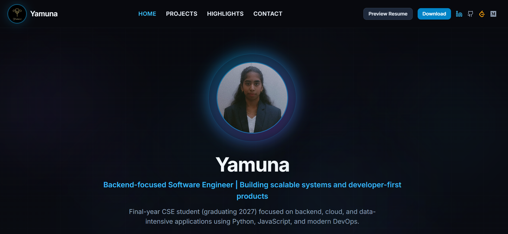

<h1 align="center">
  
  Hey, I'm Yamuna
</h1>

  

  <b>4th Year Computer Science Engineering Student</b> 
  <i>Backend & Full‑Stack Dev · DSA & CP · AI/ML Experiments · Open Source</i>

<!-- Social Badges -->

  
  
  
  
  

---

## 👩‍💻 A quick intro

> I like taking ideas, wiring them into code, and pushing them until they feel like a real product.

- 4th year CSE student from **Madurai, Tamil Nadu**  
- Spend most of my time on **backend, full‑stack apps and DSA**  
- Build with **FastAPI / Node.js / Express / React / Next.js**  
- Enjoy mixing **AI/ML, automation and clean UI/UX**  
- Write on **Medium** and ship projects on my **portfolio**  

---

## 🌐 Languages

  
  
  
  

---

## 💻 Programming

  
  
  
  
  

---

## 🛠 Tech Stack

### Backend

  
  
  
  
  
  

### DevOps / Cloud

  
  
  
  
  
  
  

### AI / ML

  
  
  
  
  
  

### Databases

  
  
  
  

### Frontend

  
  
  
  
  
  

### Tools

  
  
  
  
  

---

## ⭐ Main Projects

> A few repos I’m proud of (more on my portfolio).

- 💸 **[Money_Mirror](https://github.com/Yamuna-b/Money_Mirror)**  
  Smart personal finance tracker focusing on habits, insights and a clean UX.

- 🌊 **[MarineTaxaAi](https://github.com/Yamuna-b/MarineTaxaAi)**  
  AI-powered marine species classification with ML models and an intuitive interface.

- 📜 **[LogBeacon](https://github.com/Yamuna-b/LogBeacon)**  
  Log analysis and monitoring tool aimed at better debugging and observability.

- 🏙 **[Namma-Oor-Fix](https://github.com/Yamuna-b/Namma-Oor-Fix)**  
  City issue reporting platform to help citizens raise and track local problems.

- 🪐 **ExoVision – [nasa-spaceapps-exoplanet](https://github.com/Yamuna-b/nasa-spaceapps-exoplanet)**  
  NASA Space Apps project exploring and classifying exoplanets with ML and visual exploration.

- 🚅 **[PorterSeva](https://github.com/Yamuna-b/PorterSeva)**  
  Service platform concept for porters/helpers with a full‑stack workflow.

- 🐶 **[Petimony](https://github.com/Yamuna-b/Petimony)**  
  Pet‑focused platform with strong emphasis on UI, storytelling and user journeys.

---

## 📊 GitHub Vibes

  
  

  

---

## 📈 GitHub Contribution Graph

  

---

## 🧩 DSA & LeetCode

  

  <b>Past 1 year:</b> 304 submissions  ·  137 active days  ·  max streak: 36 days

---

## 🔭 Right now, my focus is

- Backend + full‑stack architectures  
- Production‑ready APIs and real‑world use cases  
- DSA & CP for placements  
- Cloud, automation and deployment workflows  
- AI/ML features that actually solve something  

If you’re building something interesting and need a **backend, AI/ML, or frontend brain**, I’m usually up for collabs.

---

## 🖥 Portfolio Preview

  

  <a href="https://yamuna-b.vercel.app/" style="font-size:20px; font-weight:bold;">Yamuna Portfolio</a> 
  <em>click to view</em>

